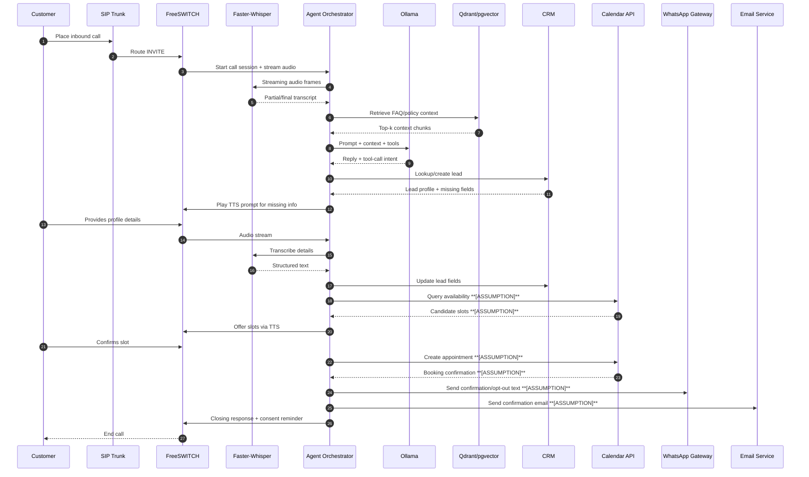
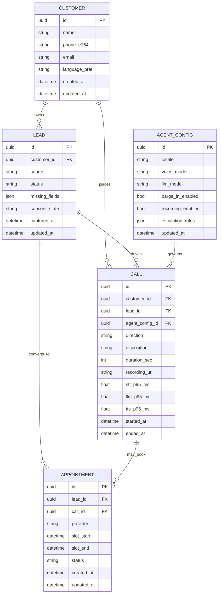

# Loonlet Architecture

This document reconciles repository evidence with a production target architecture.

- Current-state evidence is in `docs/features.md`.
- The diagrams below show the recommended OSS-only production architecture because most runtime components are not yet implemented.
- Any behavior not directly evidenced in code is marked **[ASSUMPTION]**.

## 1) System Component Architecture (Target)

```mermaid
flowchart LR
    Customer[(Customer Caller)]
    Admin[(Business Admin)]

    subgraph Telephony[Telephony Layer]
      SIP[SIP Trunk Provider\n(Asterisk/OpenSIPS-compatible)]
      FS[FreeSWITCH Cluster\nInbound/Outbound/Dialplan]
      RTP[RTP Audio Stream Bridge]
    end

    subgraph Voice[AI Voice Pipeline]
      VAD[Silero VAD\nTurn-taking/Barge-in]
      STT[Faster-Whisper Service\nStreaming STT]
      ORCH[Agent Orchestrator\nPipecat/Python Service]
      LLM[Ollama Inference\nLlama/Mistral]
      TOOLS[Tool Router\nCRM/Booking/Notifications]
      TTS[Piper TTS\nStreaming Synthesis]
    end

    subgraph RAG[RAG Knowledge Base]
      INGEST[Document Ingestion Worker]
      EMB[Embedding Model\n(BGE/E5)]
      VDB[(Qdrant/pgvector)]
      KB[(Product/Policy Docs)]
    end

    subgraph Data[Integrations and Data]
      API[Core API Service]
      WEBHOOK[Lead Webhook Receiver]
      CRM[(CRM: EspoCRM/Twenty/SuiteCRM)]
      CAL[(Calendar Service)]
      WA[(WhatsApp Gateway\nChatwoot + WA Connector)]
      EMAIL[(Postal/Mailtrain SMTP Service)]
      DB[(PostgreSQL)]
      OBJ[(S3/MinIO Recordings)]
      CACHE[(Redis Queue)]
    end

    subgraph Ops[Observability and Security]
      OTel[OpenTelemetry Collector]
      Prom[Prometheus]
      Graf[Grafana]
      Loki[Loki Logs]
      Vault[Vault/SOPS Secrets]
    end

    Admin --> API
    Customer --> SIP --> FS --> RTP --> VAD --> STT --> ORCH
    ORCH --> LLM
    ORCH --> TOOLS
    TOOLS --> API
    API --> CRM
    API --> CAL
    API --> WA
    API --> EMAIL
    API --> DB
    API --> CACHE
    API --> OBJ
    ORCH --> TTS --> RTP --> FS --> SIP --> Customer

    ORCH --> VDB
    INGEST --> EMB --> VDB
    KB --> INGEST

    FS --> OTel
    API --> OTel
    ORCH --> OTel
    OTel --> Prom --> Graf
    OTel --> Loki
    Vault --> API
    Vault --> ORCH
    Vault --> FS
```

## 2) End-to-End Call Flow Sequence (Inbound -> Qualification -> Booking -> Confirmation)



## 3) Deployment Architecture (Single VM + Scaled Multi-Node)

```mermaid
flowchart TB
    subgraph Internet[Public Network]
      Caller[(Caller)]
      Admin[(Admin Browser)]
      SIPP[(SIP Provider)]
    end

    subgraph Edge[DMZ / Edge]
      LB[Ingress + TLS\n(NGINX/Traefik)]
      SBC[Session Border Controller\n(OpenSIPS/Kamailio) **[ASSUMPTION]**]
    end

    subgraph Small[Single-VM Deployment (SMB)]
      FS1[FreeSWITCH]
      API1[Core API + Webhook]
      AG1[Agent Orchestrator]
      STT1[Faster-Whisper]
      LLM1[Ollama]
      TTS1[Piper]
      DB1[(PostgreSQL)]
      RD1[(Redis)]
      OB1[(MinIO)]
      OBS1[OTel + Prometheus + Grafana + Loki]
    end

    subgraph Scale[Kubernetes Multi-Node (High Volume)]
      K8S[K8s Control Plane]
      FSPool[FreeSWITCH Pool]
      APIPool[API Pods]
      AGPool[Orchestrator Pods]
      STTPool[STT GPU Nodes]
      LLMPool[LLM GPU Nodes]
      TTSPool[TTS Nodes]
      Data[(Managed/Postgres HA + Redis + Object Storage)]
      ObsStack[OTel + Prometheus + Grafana + Loki + Alertmanager]
    end

    Caller --> SIPP --> SBC --> FS1
    Caller --> SIPP --> SBC --> FSPool
    Admin --> LB --> API1
    Admin --> LB --> APIPool

    FS1 --> AG1 --> STT1
    AG1 --> LLM1
    AG1 --> TTS1
    API1 --> DB1
    API1 --> RD1
    API1 --> OB1
    AG1 --> API1
    FS1 --> OBS1
    API1 --> OBS1
    AG1 --> OBS1

    FSPool --> AGPool --> STTPool
    AGPool --> LLMPool
    AGPool --> TTSPool
    APIPool --> Data
    AGPool --> APIPool
    FSPool --> ObsStack
    APIPool --> ObsStack
    AGPool --> ObsStack
```

## 4) Core Data Model (ER)



## 5) GPU and Performance Guidance

- Single VM baseline **[ASSUMPTION]**: 1 x NVIDIA L4/A10 class GPU, 16 vCPU, 64 GB RAM for low-to-medium concurrent calls.
- Scaled cluster **[ASSUMPTION]**: separate GPU pools for STT and LLM to isolate contention; keep TTS CPU-bound unless premium voices require GPU.
- Latency target **[ASSUMPTION]**: median turn latency under 1.5s and p95 under 2.5s for natural voice interaction.

For rollout priorities and acceptance criteria, see `docs/roadmap.md`. For operational controls, see `docs/security.md`.

